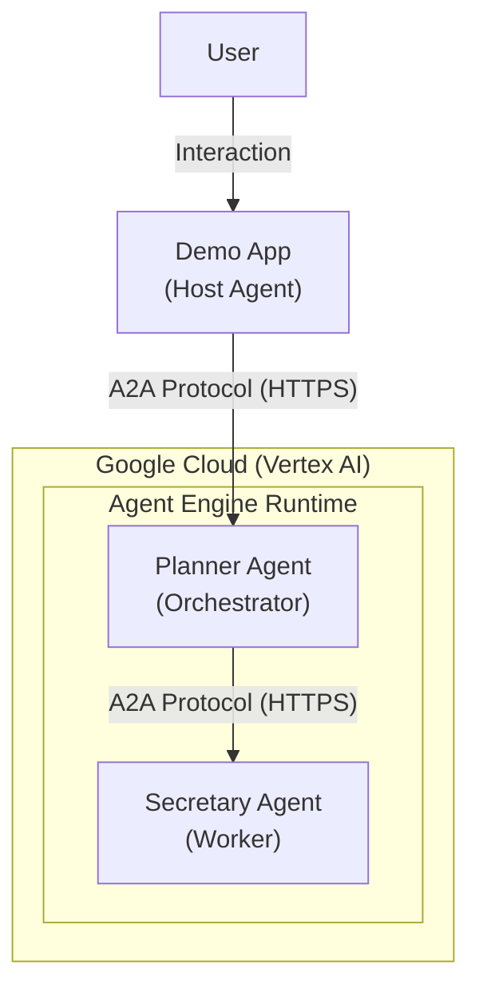
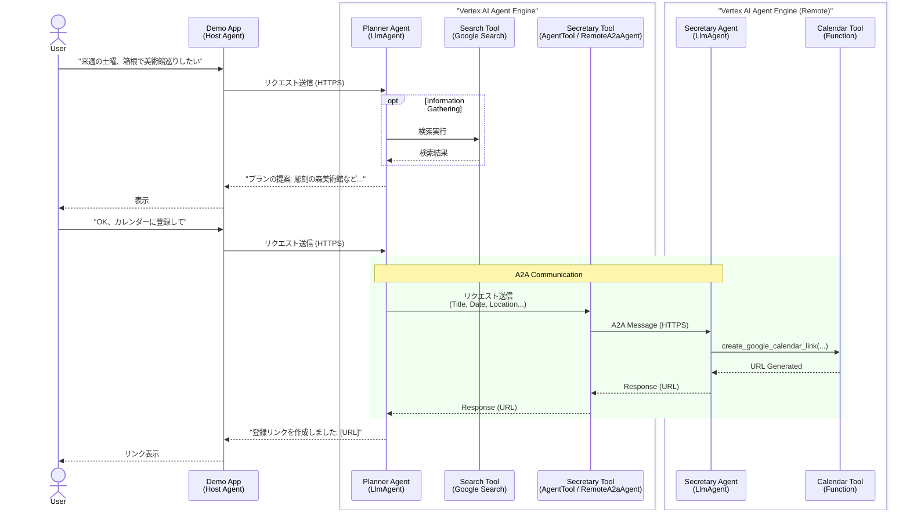
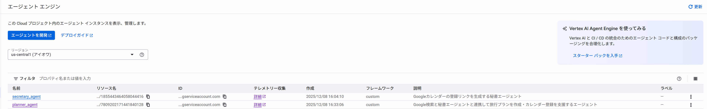
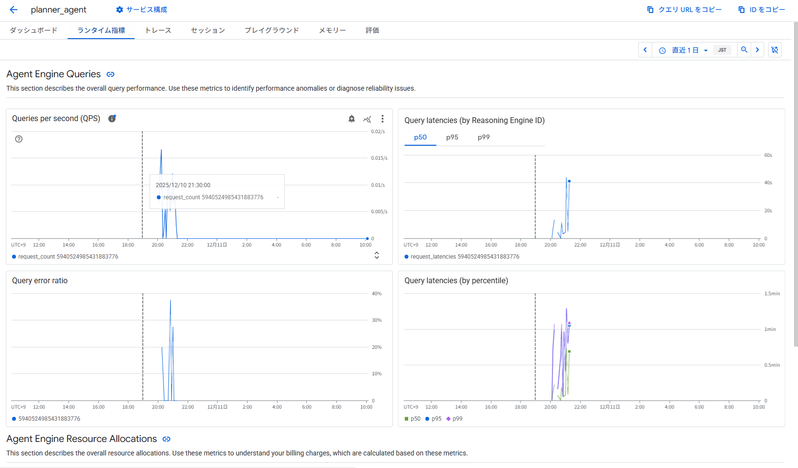
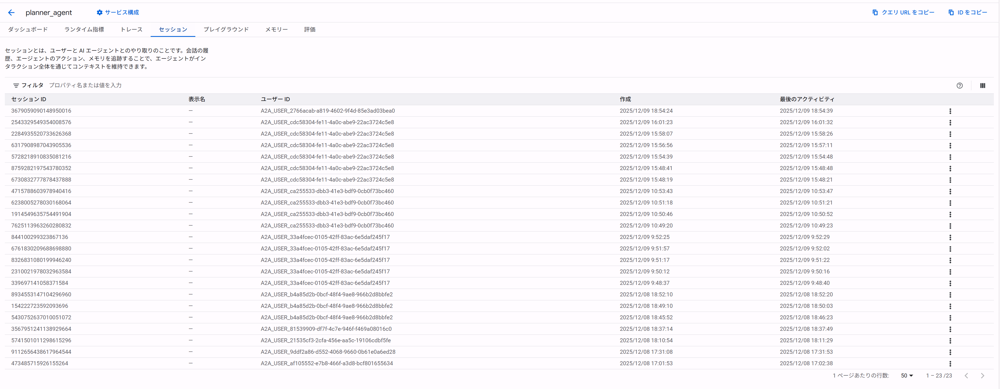
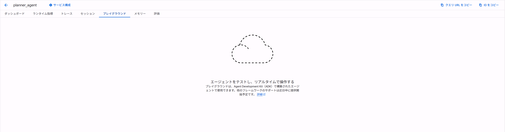
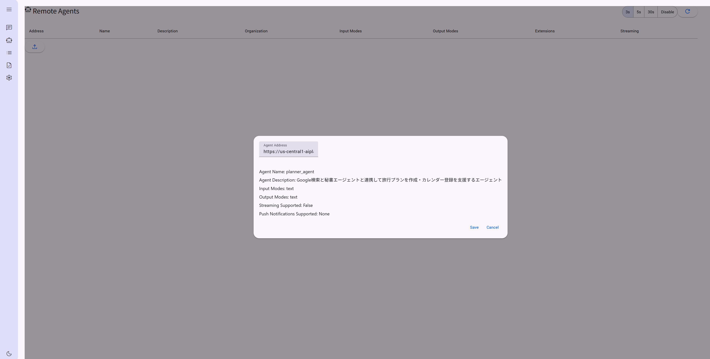
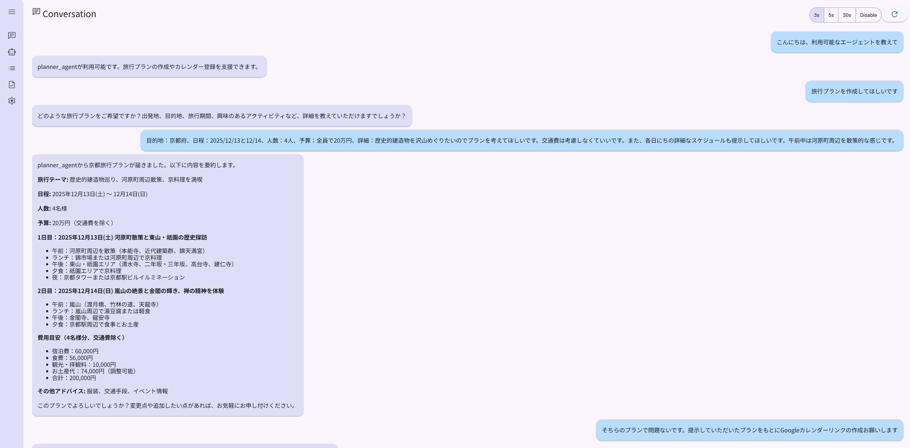
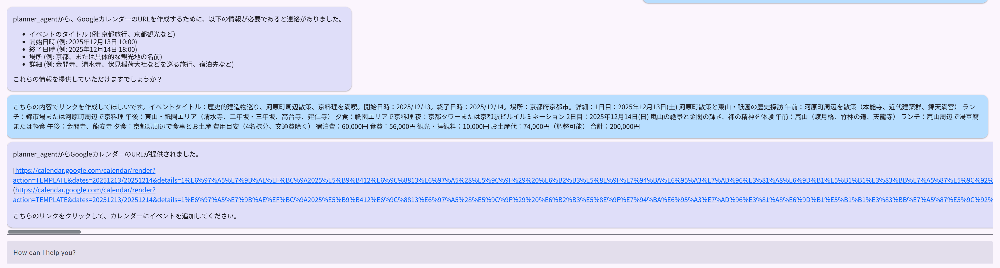

# A2Aで構成されたAIエージェントをAgentEngineにデプロイしてみた

## はじめに

Google Cloud の Vertex AI Agent Engine が進化しています。特に2025年9月頃のアップデートにより、**Agent Engine が A2A (Agent-to-Agent) プロトコルにネイティブ対応** したことは、マルチエージェントシステムの開発者にとって大きなニュースでした。

これまで A2A 通信を行うためには、別途 A2A サーバーを構築・運用する必要がありましたが、Agent Engine のマネージドランタイムがこれをサポートしたことで、インフラ管理の手間が大幅に削減されました。

本記事では、旅行プランを提案する「Planner Agent」と、カレンダー登録を行う「Secretary Agent」という2つのエージェントを連携させるデモアプリを作成し、実際に Agent Engine 上にデプロイして動作させるまでの手順を紹介します。

**本記事の注目ポイント:**
*   **Agent Engine の A2A ネイティブ対応**: 別途サーバーを立てずにエージェント間通信を実現する方法。
*   **実践的なデプロイフロー**: 依存関係の解決や環境変数の扱いなど、ハマりやすいポイントを押さえたデプロイスクリプトの解説。
*   **Agent-as-a-Tool パターンによる連携**: `RemoteA2aAgent` と `AgentTool` を用いて、リモートエージェントと連携する実装パターン。

---

## 1. Agent Engine とは

**Vertex AI Agent Engine** は、AI エージェントを本番環境でデプロイ、管理、スケーリングするためのマネージドサービスです。開発者はエージェントのロジックに集中でき、インフラのスケーリングやセキュリティ（IAM, VPC-SC）は Agent Engine が担います。

### できること (主な機能)
*   **マネージドランタイム**: Python ベースのエージェント（LangChain, LlamaIndex, ADK など）をコンテナ化してデプロイ。
*   **A2A プロトコル対応**: 異なるフレームワークで作られたエージェント同士でも連携可能。
*   **セキュリティ**: IAM によるアクセス制御、VPC Service Controls 対応。
*   **可観測性**: Cloud Trace や Cloud Logging との統合。

### 2025年9月の A2A 対応による変化
以前は A2A 通信を行うために、エージェントとは別に A2A サーバー（ルーティングやメッセージングを担うホスト）をデプロイする必要がありました。しかし、Agent Engine 自体が A2A プロトコルのエンドポイントを持つようになったため、**エージェントをデプロイするだけで、即座に他のエージェントから呼び出し可能な状態** になります。これにより、マイクロサービスのようにエージェントを組み合わせてシステムを構築することが容易になりました。

### 現状の課題と推奨事項（筆者の検証ベース）

今回の検証を通じて、筆者が確認できた範囲と現状の課題についても共有しておきます。

#### 動作確認できた構成
現時点では、**Google ADK (Agent Development Kit)** と A2A を組み合わせたエージェント構成においてのみ、デプロイからエージェントの正常稼働までを一貫して成功させることができました。

#### CrewAI との組み合わせにおける課題
人気の高いエージェントフレームワークである **CrewAI** と A2A を組み合わせたエージェントの作成も試みました。この構成でも Agent Engine へデプロイ自体は成功したものの、実際にリクエストを送信してもエージェントからレスポンスが返ってこないという事象が発生しました。
これについては筆者の実装方法に問題がある可能性も高いですが、現時点では解決に至っていません。

#### 推奨事項
Vertex AI Agent Engine は Google Cloud のマネージドサービスです。そのため、Google 純正のフレームワークである **ADK** が、新機能の先行実装やサポートの面で優遇されることは明白です。
安定した運用や最新機能の恩恵を最大限に受けるためには、可能な限り **ADK をベースに Agent Engine を利用すること** を強く推奨します。

なお、**LangChain** については公式ドキュメントでも利用可能と明記されており、サポートレベルも高いとされています。今回は未検証ですが、問題なく動作する可能性が高いと考えられます。

---

## 2. ソースコードとアーキテクチャ

※本記事では、A2A エージェントのデプロイと構成に焦点を当てています。各エージェントの具体的なソースコードの実装詳細については、別途ブログ記事を投稿予定のため、本記事では割愛します。

今回は、以下の2つのエージェントで構成される「スマート・トラベルチーム」を作成しました。

### アーキテクチャ概要

今回のシステムは、Vertex AI Agent Engine 上に独立してデプロイされた2つのエージェントが、A2A プロトコルを通じて連携する構成になっています。
ユーザーが利用する **Demo App** 内部では **Host Agent** が稼働しており、この Host Agent がユーザー入力を受け取り、事前に登録（Register）されたリモートの Planner Agent へとタスクを振り分ける役割を担います。なお、クラウド環境ではこれらの通信は **HTTPS** で行われます。



#### エージェントの役割

*   **Planner Agent (Orchestrator)**:
    *   ユーザーの窓口となり、旅行プランを提案します。
    *   Google検索ツール (`Search Agent`) を使って情報を収集します。
    *   プランが決まったら、`Secretary Agent` にカレンダー登録を依頼します。
*   **Secretary Agent (Worker)**:
    *   Planner からの指示（タイトル、日時など）を受け取り、Googleカレンダーの登録リンクを生成して返します。Secretary Agent が内部的に Google Calendar API を呼び出す際には、Google の認証メカニズムを通じて安全な HTTPS 通信が行われます。

#### インタラクションフロー

ユーザーのリクエストを受け、Host Agent が Planner Agent を呼び出し、必要に応じて検索や Secretary Agent との連携を経てタスクを完了するまでの流れは以下の通りです。



### 実装のポイント：Agent-as-a-Tool パターンによる連携

Planner Agent が Secretary Agent を呼び出す際、ADK の **`AgentTool`** と **`RemoteA2aAgent`** を使用して連携を実現しています。

これにより、Planner Agent はリモート（別の Agent Engine リソース）で動作している Secretary Agent を、まるでローカルのツールであるかのように自然に呼び出すことができます。裏側では A2A プロトコルを用いた通信が行われていますが、エージェントの実装者はその複雑さを意識する必要がありません。

```python
# Planner Agent の実装 (抜粋)
from google.adk.agents.remote_a2a_agent import RemoteA2aAgent
from google.adk.tools.agent_tool import AgentTool

# ... (中略) ...

# 1. リモートエージェントの定義
# Secretary Agent の接続先情報を設定
# secretary_url はデプロイ時に環境変数から設定される (https://.../a2a/v1/card)
secretary_remote_agent = RemoteA2aAgent(
    name="secretary_agent",
    description="旅行プランナーからの指示でGoogleカレンダー登録リンクを作成する秘書エージェント...",
    agent_card=secretary_url,
    a2a_client_factory=factory,
)

# 2. AgentTool としてラップ
secretary_agent_tool = AgentTool(secretary_remote_agent)

# 3. Planner Agent にツールとして登録
planner_agent = LlmAgent(
    name='planner_agent',
    # ...
    tools=[
        search_agent_tool,   # Search Agent (AgentTool)
        secretary_agent_tool # Secretary Agent (AgentTool/Remote)
    ], 
)
```

### ファイル構成

```text
my_travel_agent_project/ # プロジェクトルートフォルダ
├── requirements.txt            # 依存ライブラリ（google-adk, vertexai, etc.）
├── deploy_travel_team.py       # デプロイ用スクリプト
├── run_agent_server.py         # ローカル実行用サーバー起動スクリプト (Planner)
├── run_secretary_server.py     # ローカル実行用サーバー起動スクリプト (Secretary)
├── .env                        # 環境変数 (Project ID, Location)
│
├── travel_team/                # 今回のプロジェクト専用パッケージ
│   ├── __init__.py
│   │
│   ├── agents/                 # エージェント定義
│   │   ├── __init__.py
│   │   ├── planner_agent.py    # Orchestrator
│   │   ├── secretary_agent.py  # Worker (Calendar)
│   │   └── search_agent.py     # Worker (Search) - 新規追加
│   │
│   └── tools/                  # ツール定義
│       ├── __init__.py
│       ├── calendar_tools.py   # カレンダーURL生成ロジック
│       └── search_tools.py     # Google検索ツールのラッパー
│
└── utils/                      # 共通ユーティリティ
    ├── __init__.py
    └── a2a_helpers.py          # 認証、A2A接続ヘルパー
```

---

## 3. デプロイとデモ

エージェントを Agent Engine にデプロイするためのスクリプト `deploy_travel_team.py` を作成しました。

### デプロイスクリプトの詳細解説

A2A 構成のエージェントをデプロイする際、単に API を叩くだけではうまくいかないケースがあります。今回は安定したデプロイを実現するために、いくつかの工夫をスクリプトに組み込みました。

#### 1. 認証と初期化プロセス

デプロイを開始する前に、まず Google Cloud への認証と Vertex AI の初期化を行います。`staging_bucket` は非常に重要で、ここにローカルのソースコードや依存パッケージが一時的にアップロードされ、クラウド上でのビルドに使用されます。

```python
# 認証情報の取得
credentials, project_id = google.auth.default()

# Vertex AI SDK の初期化
# staging_bucket: ローカルコードをアップロードするGCSバケット
vertexai.init(
    project=project_id, 
    location='us-central1', 
    staging_bucket=f'gs://{project_id}'
)
```

#### 2. Agent Card によるインターフェース定義

デプロイ前に `get_agent_card` を呼び出し、エージェントの定義情報（Agent Card）を生成します。これにはエージェントの名前、説明、入力スキーマなどが含まれ、他のエージェントがこのエージェントを呼び出す際の「取扱説明書」のような役割を果たします。

```python
# Agent Card (定義情報) の取得
secretary_agent_card_obj = await get_agent_card(secretary_agent)
```

#### 3. Agent Engine の作成 (ReasoningEngine.create)

`ReasoningEngine.create` メソッドは、デプロイの中核となる処理です。このメソッドを実行すると、以下のプロセスが自動的に行われます。

1.  **パッケージング**: `extra_packages` で指定されたローカルディレクトリ（今回は `./travel_team` と `./utils`）がアーカイブされます。
2.  **アップロード**: アーカイブと `requirements` が指定したステージングバケットにアップロードされます。
3.  **クラウドビルド**: Cloud Build が起動し、指定された依存ライブラリ (`requirements_list`) をインストールしたコンテナイメージを作成します。
4.  **デプロイ**: 作成されたコンテナが Cloud Run 上にデプロイされ、Agent Engine のエンドポイントとして公開されます。

```python
# Agent Engine の作成とデプロイ
created_secretary_engine = ReasoningEngine.create(
    secretary_a2a_agent_instance,
    display_name='secretary_agent',
    requirements=requirements_list, # 依存ライブラリ
    extra_packages=["./travel_team", "./utils"], # アップロードするソースコード
)
```

#### 4. コードの最新化 (Hot Reload) と 依存関係の解決

デプロイスクリプトを実行する際、Python のインポートキャッシュによって古いコードが参照されてしまうことを防ぐため、`importlib.reload` を使用してモジュールを強制的に再読み込みしています。また、エージェント間の依存関係（Planner は Secretary の URL を知る必要がある）を解決するため、Secretary を先にデプロイする順序制御を行っています。

```python
# Secretary Agent を先に処理
import travel_team.agents.secretary_agent
importlib.reload(travel_team.agents.secretary_agent) # 最新コードをロード
from travel_team.agents.secretary_agent import secretary_agent

# ... (Secretary のデプロイ処理) ...

# Secretary のリソース名を環境変数にセット (Planner が参照するため)
os.environ['SECRETARY_RESOURCE_NAME'] = secretary_resource_name

# Planner Agent を処理
import travel_team.agents.planner_agent
importlib.reload(travel_team.agents.planner_agent) # 環境変数がセットされた状態でリロード
from travel_team.agents.planner_agent import planner_agent
```

#### 5. コンテナの確実な更新 (Delete & Create)

Agent Engine は `extra_packages` オプションを使ってローカルのソースコードをクラウド上のコンテナにアップロードします。しかし、既存のエージェントに対して `update` API を呼ぶだけでは、このソースコードパッケージが正しく更新されない場合がありました。
そこで、今回は**既存のエージェントを一度削除し、新規に作成し直す**という戦略を採用しました。これにより、常に最新のソースコードが含まれたコンテナがビルドされることを保証します。

```python
# 既存のリソースがある場合は削除して、強制的に再作成する
if secretary_resource_name:
    print(f"  Deleting existing agent: {secretary_resource_name} to force update...")
    try:
        # LRO (Long Running Operation) なので完了を待つ (.result())
        client.agent_engines.delete(name=secretary_resource_name).result()
        print("  Deletion complete.")
    except Exception as e:
        print(f"  Warning: Failed to delete existing agent: {e}")
```

これらのテクニックにより、コードの変更を即座にクラウド環境へ反映させ、スムーズな開発サイクルを実現しています。

### 実行結果

スクリプトを実行すると、以下のように2つのエージェントが順次デプロイされます。

```bash
$ uv run python deploy_travel_team.py
...
Processing secretary_agent...
  Created. Resource Name: projects/.../reasoningEngines/123456...

Processing planner_agent...
Configuring Secretary Agent with Cloud URL: https://...
  Created. Resource Name: projects/.../reasoningEngines/789012...

All travel agents deployed successfully!
```

実際のGoogle Cloudコンソール画面でも、以下のように2つのエージェント（`planner_agent` と `secretary_agent`）が正しくデプロイされていることが確認できます。


*図: Agent Engine にデプロイされた2つのエージェント*

### Agent Engine の管理機能

デプロイ後の管理画面についても少し触れておきます。Agent Engine では、エージェントの運用に必要な基本機能が提供されています。


*図: ランタイム指標の確認*


*図: セッション管理の画面*

ランタイムの指標確認やセッション管理など、本番運用を見据えた機能が標準で備わっているのは心強いポイントです。

一方で、A2A 対応のエージェントに関しては、まだ発展途上の部分もあります。
現状では、コンソール上で手軽にエージェントをテストできる「プレイグラウンド」や、詳細な利用状況・コスト・ログを可視化する「ダッシュボード」といった、より高度な運用機能はまだ利用できません。


*図: プレイグラウンドやダッシュボード機能は近日公開予定*

しかし、これらは「近日公開予定」となっており、今後のアップデートで実装されることが期待されています。これらが解放されれば、開発から運用、モニタリングまでが Agent Engine 上で完結するようになり、開発者体験はさらに向上するでしょう。今後の進化が非常に楽しみです。

### 動作確認

作成したデモアプリを使って、実際に `Planner Agent` と対話してみます。本デモでは、`a2a-samples` に付属する `demo/ui` を利用しています。ただし、GitHubからクローンしただけではGoogle CloudのAgent Engineには接続できないため、裏側に多少の手を加えて接続できるようにしています。

まず、デモアプリにエージェントを登録します。Agent Engine のエンドポイント情報を入力し、アプリがエージェントと通信できるようにします。


*図: デモアプリへの Agent Card 登録画面*

登録が完了したら、チャット画面で Planner Agent に話しかけます。ここでSecretary Agentを直接登録する必要はありません。Planner Agentがユーザーのリクエストに応じて動的にA2AでSecretary Agentと通信し、タスクを依頼するため、ユーザーが直接Secretary Agentにタスクを依頼する必要がないためです。

**User**: 「12/13，14に京都で歴史的建造物をめぐるプラン立てをしたいです。」

Planner Agent は内部で `Search Agent` (Google検索) を呼び出し、おすすめの美術館を調べて提案してくれます。


*図: Planner Agent が検索結果に基づいて旅行プランを提案*

提案されたプランが気に入ったので、カレンダーへの登録を依頼します。

**User**: 「いいですね。そのプランでカレンダーに入れておいて。」

すると、Planner Agent は `Secretary Agent` (別プロセスで稼働する A2A エージェント) を呼び出し、カレンダー登録用のURLを発行してもらいます。


*図: Secretary Agent と連携し、Googleカレンダー登録リンクを生成して返答*

このように、Planner が自律的に判断し、別のエージェントである Secretary を呼び出してタスクを完遂する様子が確認できました。ユーザーからは1つのエージェントと話しているように見えますが、裏側では複数のエージェントが連携して動いています。

---

## 4. まとめ

本記事では、Vertex AI Agent Engine の A2A 対応機能を活用し、マルチエージェントシステムを構築・デプロイする方法を紹介しました。

*   **インフラレス**: A2A サーバーの構築が不要になり、エージェントの開発とロジックに集中できるようになった。
*   **柔軟な連携**: Agent Engine のエンドポイントを叩くシンプルな構成で、異なる役割を持つエージェント同士を連携させることができた。
*   **デプロイのコツ**: 依存関係のあるエージェントのデプロイ順序や、ソースコード更新時の再作成フローなどをスクリプト化することで、運用をスムーズにできる。

Agent Engine は今後も機能拡張が予定されており、エンタープライズレベルの自律型エージェント開発において強力な基盤となるでしょう。ぜひ皆さんも試してみてください。


