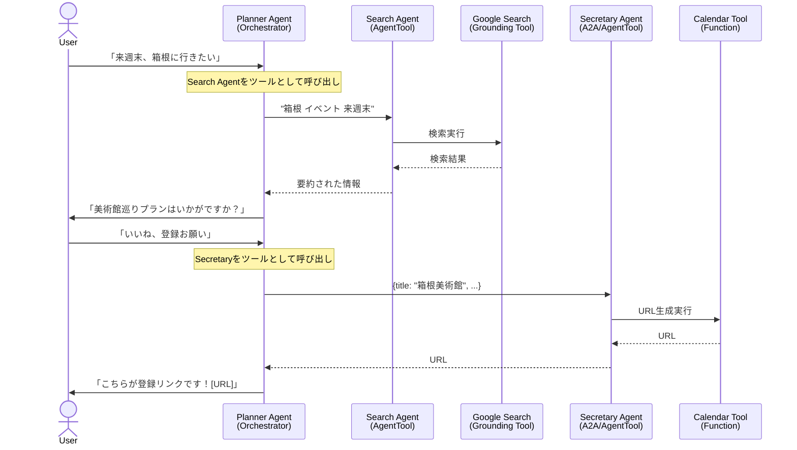

# スマート・トラベルチーム 設計定義書

## 1. プロジェクト概要
ユーザーの要望に基づいて旅行プランを提案し、最終的なスケジュールをGoogleカレンダーに登録するためのリンクを生成するマルチエージェントシステム。

## 2. アーキテクチャパターン
**Orchestrator-Workers with Agent-as-a-Tool** を採用。

*   **Orchestrator (指揮者)**: `Planner Agent`
    *   ユーザーとの対話、プランニング、および各専門エージェント（ツール）への指示出しを担当。
    *   各Workerエージェントを `AgentTool` として利用し、タスクを委譲して結果を受け取る。
*   **Worker (作業者)**:
    *   `Search Agent`: Google検索を担当。
    *   `Secretary Agent`: カレンダーリンク生成を担当。

## 3. ファイル・フォルダ構成

```text
my_travel_agent_project/ # プロジェクトルートフォルダ
├── requirements.txt            # 依存ライブラリ（google-adk, vertexai, etc.）
├── deploy_travel_team.py       # デプロイ用スクリプト
├── run_agent_server.py         # ローカル実行用サーバー起動スクリプト (Planner)
├── run_secretary_server.py     # ローカル実行用サーバー起動スクリプト (Secretary)
├── .env                        # 環境変数 (Project ID, Location)
│
├── travel_team/                # 今回のプロジェクト専用パッケージ
│   ├── __init__.py
│   │
│   ├── agents/                 # エージェント定義
│   │   ├── __init__.py
│   │   ├── planner_agent.py    # Orchestrator
│   │   ├── secretary_agent.py  # Worker (Calendar)
│   │   └── search_agent.py     # Worker (Search) - 新規追加
│   │
│   └── tools/                  # ツール定義
│       ├── __init__.py
│       ├── calendar_tools.py   # カレンダーURL生成ロジック
│       └── search_tools.py     # Google検索ツールのラッパー
│
└── utils/                      # 共通ユーティリティ
    ├── __init__.py
    └── a2a_helpers.py          # 認証、A2A接続ヘルパー
```

## 4. エージェント詳細設計

### A. 旅行プランナー (Planner Agent) - Orchestrator

*   **役割**: 旅行の計画立案と全体の進行管理。
*   **モデル**: `gemini-2.5-flash`
*   **Tools (Agent Tools)**:
    1.  **Search Agent Tool**: `AgentTool` でラップされた `Search Agent`。検索タスクを依頼する。
    2.  **Secretary Agent Tool (A2A)**: `AgentTool` でラップされた `RemoteA2aAgent`。カレンダー登録を依頼する。
*   **Instruction (振る舞い)**:
    1.  ユーザーから旅行の要望を聞き出す。
    2.  情報収集が必要な場合、**Search Agent Tool** を呼び出して調査を依頼する。
    3.  プランを提示し、ユーザーの合意を得る。
    4.  カレンダー登録の承諾が得られたら、**Secretary Agent Tool** を呼び出し、構造化データ（タイトル、日時など）を渡す。
    5.  Secretaryから返ってきたURLをユーザーに提示する。

### B. 秘書エージェント (Secretary Agent) - Worker

*   **役割**: スケジュール管理の実務担当。
*   **モデル**: `gemini-2.5-flash`
*   **Tools**:
    1.  **Calendar Link Generator**: 引数を受け取り、Googleカレンダー登録用URLを生成するPython関数。
*   **Instruction**:
    1.  Orchestratorから渡された情報を元に、正確なカレンダー登録URLを生成する。
    2.  URLのみを返す。

### C. 検索エージェント (Search Agent) - Worker

*   **役割**: 情報収集の専門担当。
*   **モデル**: `gemini-2.5-flash`
*   **Tools**:
    1.  **Google Search Tool (Grounding)**: ADK組み込みのGoogle検索ツール。
*   **Instruction**:
    1.  依頼された内容に基づいてGoogle検索を実行する。
    2.  検索結果を要約して回答する。

## 5. データフロー (インタラクション)



## 6. 実装上の留意点

*   **Agent-as-a-Tool パターンの採用**:
    *   Vertex AI (Gemini) の仕様上、**Google Search Grounding Tool と他の Function Calling Tool を同一のエージェントで併用することには制限がある**。
    *   これを回避するため、Google検索機能を持つ `Search Agent` を独立させ、Planner Agent からは `AgentTool(search_agent)` として呼び出す構成を採用する。
    *   同様に、Secretary Agent への接続も `AgentTool(RemoteA2aAgent(...))` として実装し、Planner Agent は純粋にツール（AgentTool）を利用する構成とする。

*   **ローカルとクラウドの構成差分**:
    *   **Planner Agent**: ローカル実行時 (`run_agent_server.py`) は、ローカルで動作する Secretary Agent (`localhost:8001`) への接続ツールを手動で注入する。Agent Engine 上では、デプロイスクリプトがクラウド上の Secretary Agent への接続ツールを注入する。
    *   **Secretary Agent**: 単独のサーバーとして動作し、リクエストを待ち受ける。

*   **認証設定**:
    *   ローカル実行時は `.env` ファイルと `GOOGLE_GENAI_USE_VERTEXAI=True` の設定により、Vertex AI の認証を通す必要がある。
