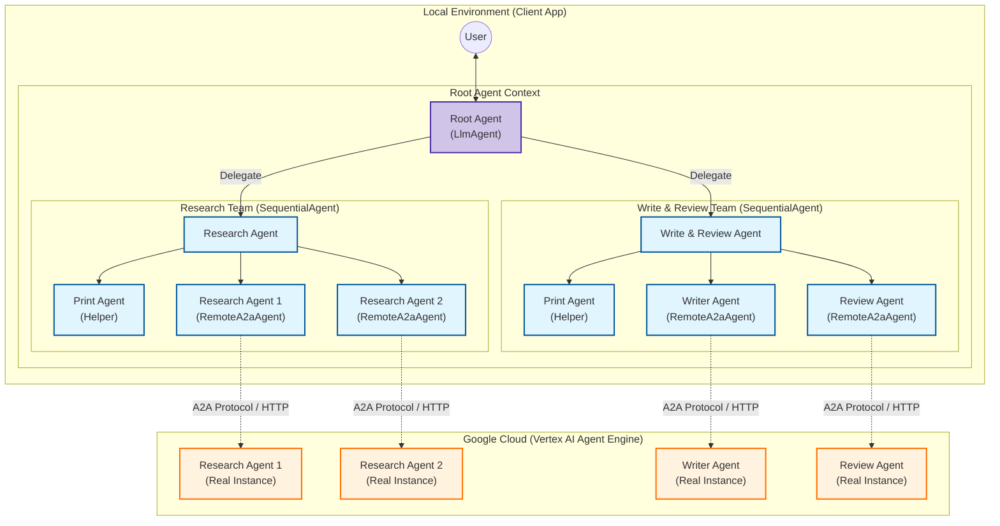
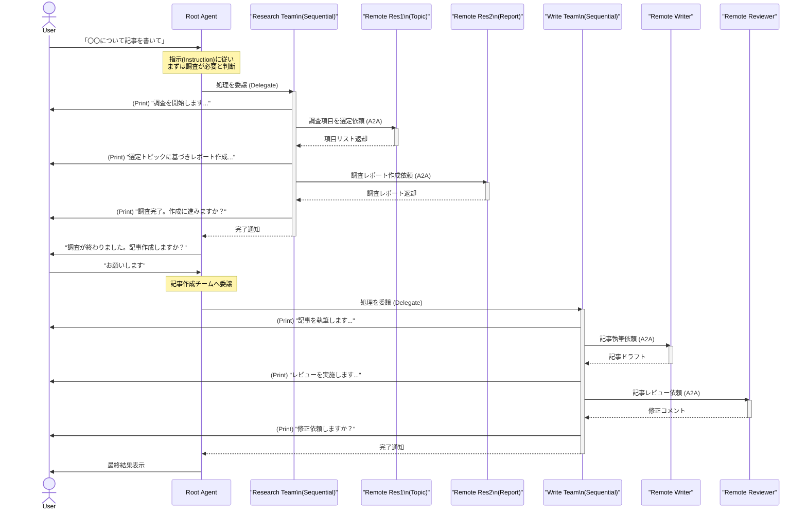

# A2A エージェントシステム構成と実行フロー

このドキュメントでは、`my_a2a_project` で構築されたマルチエージェントシステムの構造と、処理の実行フローを図解します。

## 1. エージェント構成図 (Architecture)

この図は、ローカル環境の Root Agent がどのようにサブエージェントを保持し、それらがクラウド上のエージェントとどのように接続されているかを示しています。

---

## 2. 実行フロー図 (Sequence)

ユーザーが記事作成を依頼してから、最終的な記事が出力されるまでの処理の流れです。

